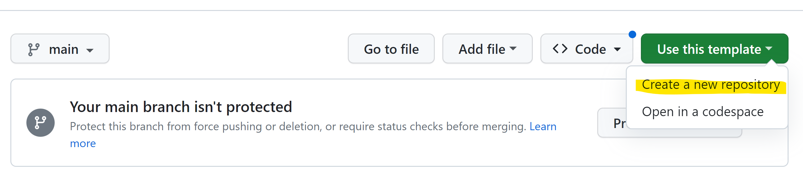
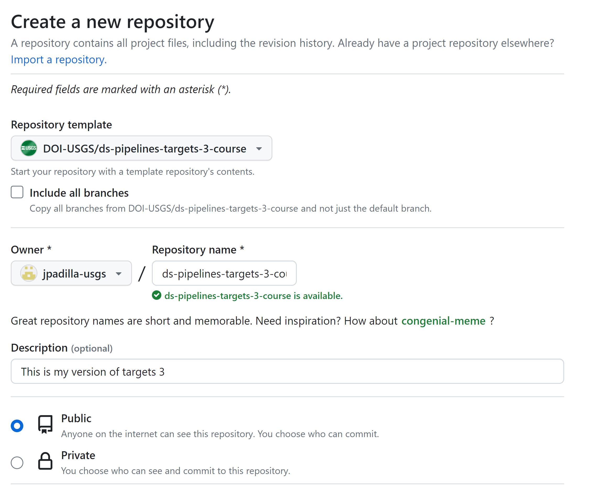
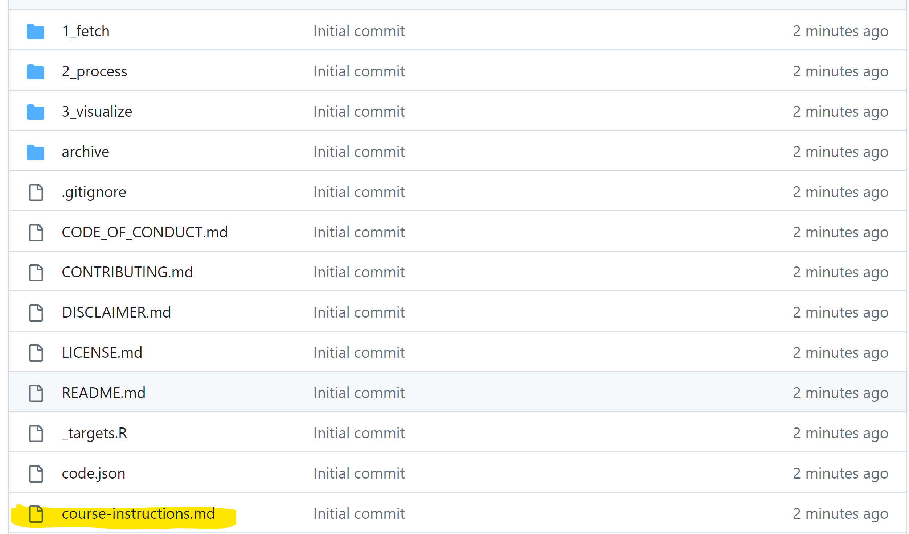

# Pipelines III: Many-task pipelines using targets

In this course, you will learn the advanced practices for building robust pipelines using the R package targets when you have steps that need to be repeated many times. To get started create a copy of this repository using the "Use this template" option in the upper right portion of the screen. Then click on course-instructions.md.

This repository is a static version of the targets training course: _Intro to targets Data Analysis Pipelines for USGS Data Science_. That course has been archived as [version 1.0.0](https://github.com/padilla410/ds-pipelines-targets-3-course-static/releases/tag/1.0.0).

## Getting started

### Getting a copy of this repository
If you are a trainee, you can get started by clicking the green "use this template" button in the upper right and then selecting "create a new repository" from the drop down menu.

Once you "create a new repository" you should see a menu of options that looks like this:

Check to make sure that you are using the right repository template. Then make sure that you select your GitHub account as the "Owner" and re-name it. We recommend using the same name as the DOI-USGS template. Finally, make sure that your GitHub repository is "Public".

### Starting the lesson

To get started you will need to create a local copy of the repository and to open the course instructions in a browser window.

To create a local copy - use `git` to `clone` a local copy of your new template.

To start the lesson, click on `course-instructions.md` and work your way through the course. We recommend viewing the instructions in the browser.

